# GitHub Actions CI/CD with Docker, AWS EC2 & Application Load Balancer

This repository demonstrates an automated CI/CD pipeline for a Node.js application using:

- **GitHub Actions** for CI/CD automation
- **Docker** for containerizing the application
- **Docker Hub** for storing Docker images
- **AWS EC2** for deploying and running multiple application instances
- **AWS Application Load Balancer (ALB)** for distributing incoming traffic across EC2 instances
- **AWS Target Group** for health checking and routing requests to healthy EC2 instances

## CI/CD Workflow

```mermaid
flowchart LR
    A[Developer] -->|Git Push| B[GitHub Repository]

    B -->|feature/**| C[GitHub Actions CI]
    C --> D[Install Dependencies]
    D --> E[Run Tests]

    B -->|Push / Merge to main| F[GitHub Actions CI/CD]
    F --> G[Run Tests]
    G --> H[Build Docker Image]
    H --> I[Push Image to Docker Hub]

    I --> J[Deploy via SSH]

    J --> K1[AWS EC2 #1]
    K1 --> L1[Pull Docker Image]
    L1 --> M1[Restart Container]
    M1 --> N1[Health Check]

    N1 --> K2[AWS EC2 #2]
    K2 --> L2[Pull Docker Image]
    L2 --> M2[Restart Container]
    M2 --> N2[Health Check]

    K1 --> TG[AWS Target Group]
    K2 --> TG

    TG --> ALB[Application Load Balancer]

    ALB --> USER[Users]
```



## Pipeline

The CI/CD pipeline consists of three main stages:

**Test → Build → Deploy**

### Test

When code is pushed to a `feature/**` branch, GitHub Actions automatically:

1. Checks out the source code.
2. Sets up the Node.js environment.
3. Installs dependencies using `npm ci`.
4. Runs automated tests using Jest.

Example feature branches:

```text
feature/login
feature/register
feature/test-ci
```

This ensures that new changes are automatically validated before being merged into the `main` branch.

Pull Requests targeting the `main` branch also trigger the test stage before the changes are merged.

### Build

When changes are pushed or merged into the `main` branch:

1. The test job runs first.
2. A new Docker image is built from the application.
3. The Docker image is tagged with both the Git commit SHA and `latest`.
4. The image is pushed to Docker Hub.

```text
GitHub Actions
      │
      ▼
Run Tests
      │
      ▼
Build Docker Image
      │
      ▼
Docker Hub
      │
      ├── demo-godi:<commit-sha>
      │
      └── demo-godi:latest
```

Using the Git commit SHA as the deployment tag allows each deployment to reference the exact version of the source code that produced the Docker image.

### Deploy

After the Docker image is successfully built and pushed, GitHub Actions automatically deploys the same application version to two AWS EC2 instances.

The deployment is performed sequentially to reduce downtime.

The deployment process is:

1. Connect to **EC2 #1** via SSH.
2. Pull the Docker image identified by the current Git commit SHA.
3. Stop and remove the previous Docker container.
4. Start the new container.
5. Verify the application using a local health check.
6. Wait for the first instance to stabilize behind the Load Balancer.
7. Connect to **EC2 #2** via SSH.
8. Repeat the Docker deployment process.
9. Verify that the second application instance is healthy.
10. Clean up unused Docker images.

```text
Docker Hub
    │
    ▼
EC2 #1
    │
    ├── docker pull
    ├── docker run
    └── health check
    │
    ▼
Wait for stabilization
    │
    ▼
EC2 #2
    │
    ├── docker pull
    ├── docker run
    └── health check
```

Each EC2 instance exposes the Node.js application using:

```text
EC2 Port 80
     │
     ▼
Docker Container
     │
     ▼
Node.js Port 3000
```

Both EC2 instances are registered in an **AWS Target Group**.

The **Application Load Balancer** receives incoming HTTP traffic and forwards requests to healthy EC2 targets.

```text
                         Internet
                            │
                            ▼
                Application Load Balancer
                            │
                            ▼
                      Target Group
                            │
                  ┌─────────┴─────────┐
                  │                   │
                  ▼                   ▼
               EC2 #1             EC2 #2
               Port 80            Port 80
                  │                   │
                  ▼                   ▼
               Docker              Docker
               Port 3000           Port 3000
```

The Target Group continuously performs health checks and allows the Load Balancer to route requests only to healthy application instances.

## Required GitHub Secrets

The following secrets must be configured in:

```text
GitHub Repository
→ Settings
→ Secrets and variables
→ Actions
```

| Secret | Description |
|---|---|
| `DOCKERHUB_USERNAME` | Docker Hub username |
| `DOCKERHUB_TOKEN` | Docker Hub Personal Access Token |
| `EC2_HOST_1` | Public IP or hostname of the first AWS EC2 instance |
| `EC2_HOST_2` | Public IP or hostname of the second AWS EC2 instance |
| `EC2_USER` | SSH username used to connect to the EC2 instances |
| `EC2_SSH_KEY` | Private SSH key used by GitHub Actions to connect to EC2 |
| `EC2_KNOWN_HOSTS` | SSH known-host entries for both EC2 instances |

Both EC2 instances use the same Docker image version during each deployment.

The Application Load Balancer and Target Group are configured directly in AWS and therefore do not require additional GitHub Secrets for the current deployment workflow.
