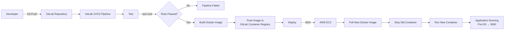

# GitLab CI/CD with Docker & AWS EC2

This repository demonstrates an automated **CI/CD pipeline** for a Node.js application using:

* **GitLab CI/CD** for pipeline automation
* **Docker** for containerizing the application
* **GitLab Container Registry** for storing Docker images
* **AWS EC2** for deploying and running the application

## CI/CD Workflow

## Pipeline

The CI/CD pipeline consists of three main stages:

**Test → Build → Deploy**

* **Test:** Install dependencies and run automated tests for the Node.js application.
* **Build:** Build a Docker image and push it to the GitLab Container Registry.
* **Deploy:** GitLab CI/CD connects to the AWS EC2 instance via SSH, pulls the latest Docker image, stops the old container, and starts a new container.

When new code is pushed to the repository, the pipeline automatically validates the application. Changes pushed to the main branch are then built into a new Docker image and deployed to AWS EC2.

----
test1
----
