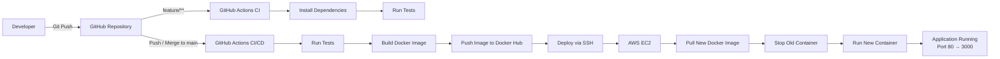

# GitHub Actions CI/CD with Docker & AWS EC2

This repository demonstrates an automated **CI/CD pipeline** for a Node.js application using:

* **GitHub Actions** for CI/CD automation
* **Docker** for containerizing the application
* **Docker Hub** for storing Docker images
* **AWS EC2** for deploying and running the application

## CI/CD Workflow



## Pipeline

The CI/CD pipeline consists of three main stages:

**Test → Build → Deploy**

### Test

When code is pushed to a `feature/**` branch, GitHub Actions automatically:

1. Checks out the source code.
2. Sets up the Node.js environment.
3. Installs dependencies using `npm ci`.
4. Runs automated tests using Jest.

Example feature branches:

```text
feature/login
feature/register
feature/test-ci
```

This ensures that new changes are automatically validated before being merged into the main branch.

### Build

When changes are pushed or merged into the `main` branch:

1. The test job runs first.
2. A new Docker image is built from the application.
3. The Docker image is tagged with the Git commit SHA and `latest`.
4. The image is pushed to Docker Hub.

```text
GitHub Actions
      │
      ▼
Build Docker Image
      │
      ▼
Docker Hub
```

### Deploy

After the Docker image is successfully built and pushed, GitHub Actions automatically deploys the application to **AWS EC2**.

The deployment process:

1. Connects to the EC2 instance via SSH.
2. Pulls the new Docker image from Docker Hub.
3. Stops and removes the previous container.
4. Starts a new container using the latest image.
5. Exposes the Node.js application through port `80`.

```text
Docker Hub
    │
    ▼
AWS EC2
    │
    ▼
Docker Container
    │
    ▼
Port 80 → Port 3000
```

## GitHub Actions Workflow

The GitHub Actions workflow is located at:

```text
.github/workflows/ci-cd.yml
```

The workflow is automatically triggered when:

```text
Push to feature/**  → Test

Pull Request → main → Test

Push / Merge → main → Test → Build → Deploy
```

## Required GitHub Secrets

| Secret               | Description                                      |
| -------------------- | ------------------------------------------------ |
| `DOCKERHUB_USERNAME` | Docker Hub username                              |
| `DOCKERHUB_TOKEN`    | Docker Hub Personal Access Token                 |
| `EC2_HOST`           | AWS EC2 public IP or hostname                    |
| `EC2_USER`           | EC2 SSH username                                 |
| `EC2_SSH_KEY`        | Private SSH key for EC2                          |
| `EC2_KNOWN_HOSTS`    | SSH known hosts information for the EC2 instance |

## Application Architecture

```text
                    ┌─────────────────────┐
                    │      Developer      │
                    └──────────┬──────────┘
                               │
                            git push
                               │
                               ▼
                    ┌─────────────────────┐
                    │       GitHub        │
                    └──────────┬──────────┘
                               │
                  ┌────────────┴────────────┐
                  │                         │
             feature/**                   main
                  │                         │
                  ▼                         ▼
          ┌───────────────┐        ┌───────────────┐
          │   Run Tests   │        │   Run Tests   │
          └───────────────┘        └───────┬───────┘
                                           │
                                           ▼
                                  ┌─────────────────┐
                                  │  Build Docker   │
                                  │      Image      │
                                  └────────┬────────┘
                                           │
                                           ▼
                                  ┌─────────────────┐
                                  │   Docker Hub    │
                                  └────────┬────────┘
                                           │
                                           ▼
                                  ┌─────────────────┐
                                  │    AWS EC2      │
                                  │                 │
                                  │  docker pull    │
                                  │  docker run     │
                                  └─────────────────┘
```
